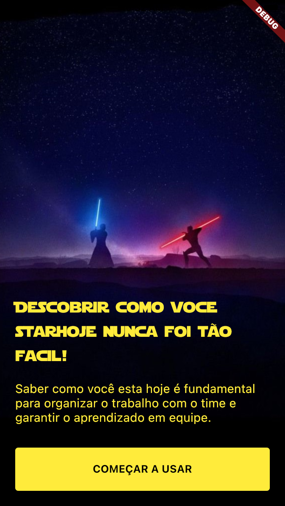
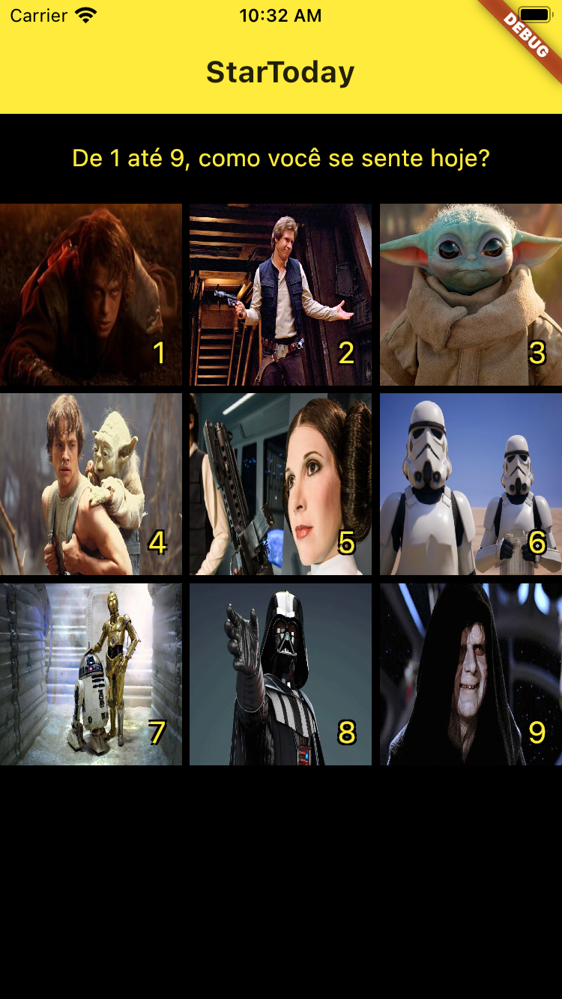
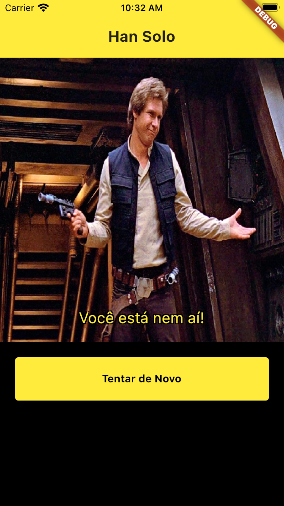

# Desafio Flutter - Semana 1 - Alura + Nubank

## Descrição do projeto

O desafio dessa semana tem como objetivo criar 3 telas:

- Tela de Onboarding: onde iremos apresentar uma imagem e alguns textos de introdução antes do usuário navegar para as funcionalidades do aplicativo.
- Tela de Campeões (Heróis): iremos renderizar vários personagens da série starwars que irão representar alguns dos sentimentos humanos.
- Tela de Detalhamento: iremos apresentar a opção selecionada pelo usuário, além de renderizar uma frase ou descrição daquela emoção. 

A ideia desse desafio é utilizar os elementos e funcionalidades mais básicas do flutter, que vão desde os componentes de texto, containers, grids, stacks, além das funcionalidades de navegação entre telas, contando com uma pitada de humor através dos personagens da grande série de Star Wars.

## Como executar o aplicativo

#### Requisitos mínimos para executar o projeto

- Instalação do [Flutter 2.2.1](https://docs.flutter.dev/get-started/install)
- Instalação do [Dart 2.13.1](https://docs.flutter.dev/get-started/install)
- Instalação do emulador [Android Studio](https://docs.flutter.dev/get-started/editor?tab=androidstudio) - Para usuários Windows
- Instalação do [Xcode 12.4](https://developer.apple.com/download/all/?q=xcode) + emulador com a versão iOS 10 ou superior - Para usuários macOS.

#### Passo 1 - Instalação das dependências

```
$ flutter install
```

#### Passo 2 - Execução o projeto

```
$ flutter run
```

## Prévia do aplicativo

<table>
  <tr>
    <td>Tela de Onboarding</td>
     <td>Tela de Campeões</td>
     <td>Tela de Detalhamento</td>
  </tr>
  <tr>
    <td></td>
    <td></td>
    <td></td>
  </tr>
 </table>